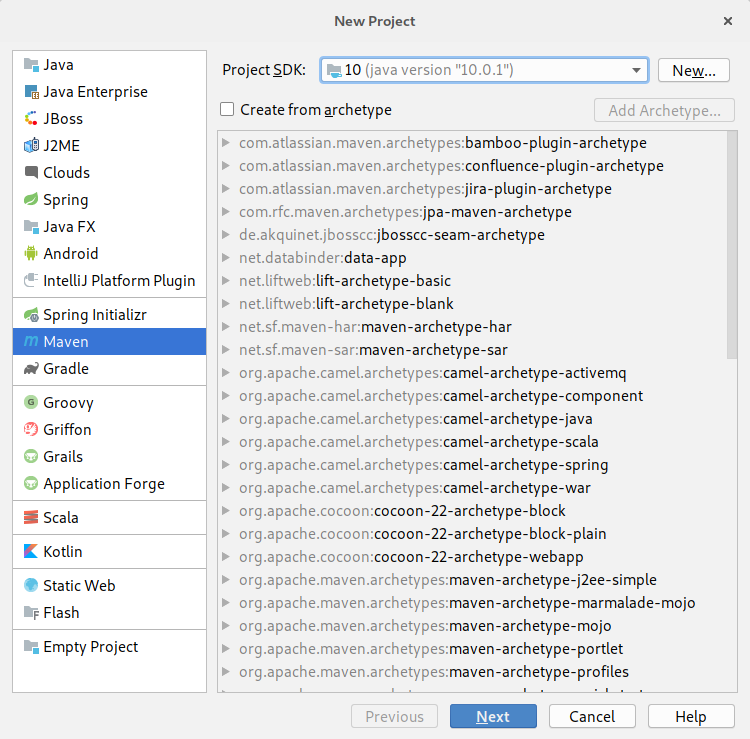
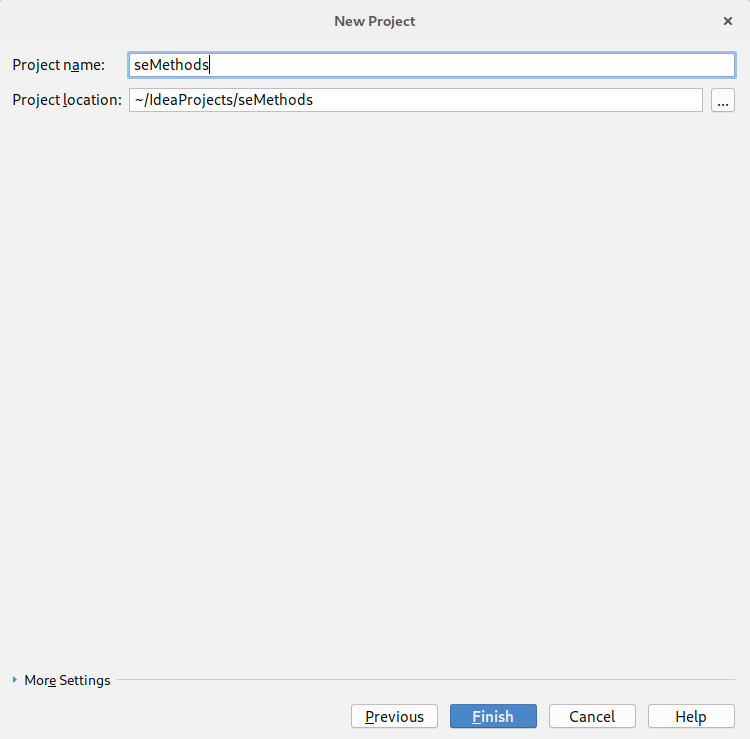
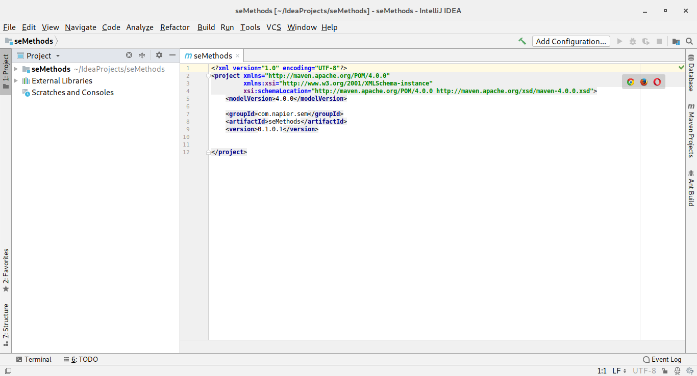

# Lab 01: Setup

The aim of this lab is to setup our development environment for the module.  There are a number of tools we are using in the module and we will set most of them up today.  The systems we will be using are:

- Java
- IntelliJ
- Maven
- Git and GitHub
- Docker

These provide a modern software development and delivery environment.  These tools will underpin the assessment for the module so getting everything setup correctly is key.

## IntelliJ Setup

You will require Java and IntelliJ installed on the machine you plan to work on.  Once ready, startup IntelliJ.  You should be presented with the following screen:


We need to create a new project, so click on **Create New Project** to open the following window:



*Replicate the same settings as shown in the image.*  You need to do the following:

1. Select **10** as Project SDK.  If IntelliJ has not detected the JDK you will need to find it.  For Windows see [here](https://stackoverflow.com/questions/16765726/how-to-set-intellij-idea-project-sdk).  If you are on Linux I assume you know what you are doing.  If you are on Mac OS X then the Windows help should be enough plus knowing where applications are installed.
2. Select **Maven** as the project type on the left.

Once done click on **Next**.  This will open the following window:


Enter the followin details:

- **GroupID** *com.napier.sem*
- **ArtifactID** *seMethods*
- **Version** 0.1.0.1

The version stands for 0.1-alpha-1.  It means this is the first version.

Click **Next** to take you to the final window:



Leave **Project name** as *seMethods*.  You can store the project wherever you choose although the default location is normally best.

Click **Finish** for your new project to be created.  This should open up the following window:



If you do not have this window then ask try the instructions again and if you still have a problem ask for help.

## Git with IntelliJ

Our next step is to setup [version control](https://en.wikipedia.org/wiki/Version_control) for our project.  We will be using [Git](https://git-scm.com/) ([Wikipedia Entry](https://en.wikipedia.org/wiki/Git)).  Git is becoming the standard version control approach in software development, so you should see this as an opportunity to learn Git.  The module does not specifically cover the mechanics of Git.  There is a dedicated [website](https://try.github.io/) for Git learning resources.  This module will focus on using Git and version control correctly to deliver software.

IntelliJ has version control built in.  Therefore we can use version control from within our development environment.  This is also becoming the standard in software development.

To setup Git version control in IntelliJ undertake the following steps:

1. In the *main menu*, select **VCS** and then **Enable VCS Integration...**.  This will open the following window:


2. In this window, select **Git** in the drop-down selection box, and click **OK**.

A little notification should appear at the bottom of the window confirming that Git has been initialised for the project.

Our next step is to add a `.gitignore` file.  This file tells Git which type of files to ignore.  This is important in software development as compilers and build systems add numerous tempory files and output files that we do not need to track.

To add a `.gitignore` file just add a new file to the project.  To do so, either use the main menu (**File** then **New** then **File**) or **right-click** on the project and select **New** then **File**.  Call the file `.gitignore` and save.  Yes, include the dot in front of the name.  Ensure the name is correct.  Git will only recognise the file with that exact name in the main folder of the repository.

Once the file is created, you need to add the Java specific files to be ignored by Git.  This can be found [here](https://github.com/github/gitignore/blob/master/Java.gitignore) or below:

```shell
# Compiled class file
*.class

# Log file
*.log

# BlueJ files
*.ctxt

# Mobile Tools for Java (J2ME)
.mtj.tmp/

# Package Files #
*.jar
*.war
*.nar
*.ear
*.zip
*.tar.gz
*.rar

# virtual machine crash logs, see http://www.java.com/en/download/help/error_hotspot.xml
hs_err_pid*
```

You will also need the Maven specific values from [here](https://github.com/github/gitignore/blob/master/Maven.gitignore) or below:

```shell
target/
pom.xml.tag
pom.xml.releaseBackup
pom.xml.versionsBackup
pom.xml.next
release.properties
dependency-reduced-pom.xml
buildNumber.properties
.mvn/timing.properties
.mvn/wrapper/maven-wrapper.jar
```

Finally, at the end of the `.gitignore` file add the following line:

```shell
.idea/
```

This last line will tell Git to ignore the files generated by IntelliJ which are created in the .idea folder.

With these in the `.gitignore` file we can add it to version control.  To do this, **right-click** on the *.gitignore* file in IntelliJ, then select **Git** then **Add**.  This will add the file ready for our first commit.

We will also add another new file: `README.md`.  This file is the readme for the project, and is written in [Markdown](https://en.wikipedia.org/wiki/Markdown).  You will be using Markdown a lot in the module for documentation.  A [tutorial](https://www.markdowntutorial.com/) is available.

So to finish this stage of our setup perform the following actions:

1. Add a new file - `README.md` to the root directory of the project.
2. Add some text to the readme - keep it simple at the moment.
3. Add `README.md` to Git (**right-click** the file, **Git** then **Add**).

## Getting Started with GitHub

Create a repo on GitHub

- SET08103, public
- Add a license Apache 2.0
- No README

Add remote to IntelliJ

- VCS, Git, Remotes
- (+ add)
- Name origin, URL, as from Git
- Start ssh-agent.cmd
- Have .ssh folder

Pull

- Select origin, just default
- Should now have a license file

Add files - VCS->Git->Add

Commit

- VCS->commit
- Message "First commit, adding initial files"
- Set, another
- Commit

Push - VCS->Git->Push

Check GitHub

## Hello World Sanity Check

Add package com.napier.sem

Add class App

Select Yes to add to Git

Enter code

Select Build->Run

If OK, VCS->Git->Add, VCS->Commit, VCS->Git->Push

## Create Dockerhub Account

