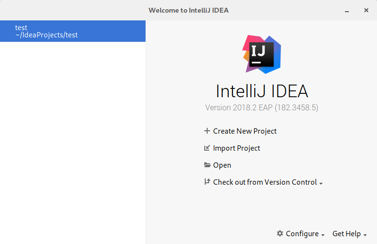
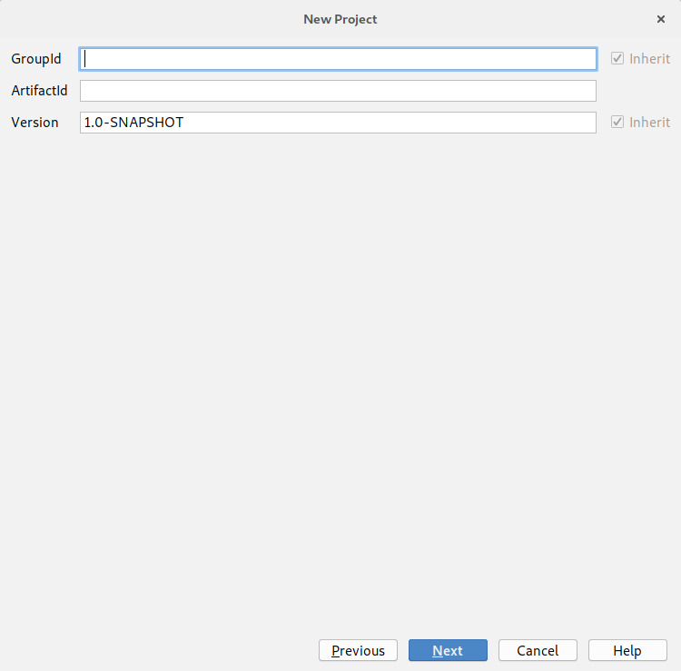

# Lab 01: Setup

The aim of this lab is to setup our development environment for the module.  There are a number of tools we are using in the module and we will set most of them up today.  The systems we will be using are:

- Java
- IntelliJ
- Maven
- Git and GitHub
- Docker

These provide a modern software development and delivery environment.  These tools will underpin the assessment for the module so getting everything setup correctly is key.

## IntelliJ Setup

You will require Java and IntelliJ installed on the machine you plan to work on.  Once ready, startup IntelliJ.  You should be presented with the following screen:

We need to create a new project, so click on **Create New Project** to open the following window:

*Replicate the same settings as shown in the image.*  You need to do the following:

1. Select **10** as Project SDK.  If IntelliJ has not detected the JDK you will need to find it.  For Windows see [here](https://stackoverflow.com/questions/16765726/how-to-set-intellij-idea-project-sdk).  If you are on Linux I assume you know what you are doing.  If you are on Mac OS X then the Windows help should be enough plus knowing where applications are installed.
2. Select **Maven** as the project type on the left.

Once done click on **Next**.  This will open the following window:

Enter the followin details:

- **GroupID** *com.napier.sem*
- **ArtifactID** *seMethods*
- **Version** 0.1.0.1

The version stands for 0.1-alpha-1.  It means this is the first version.

Click **Next** to take you to the final window:

Leave **Project name** as *seMethods*.  You can store the project wherever you choose although the default location is normally best.

Click **Finish** for your new project to be created.  This should open up the following window:

If you do not have this window then ask try the instructions again and if you still have a problem ask for help.

## Git with IntelliJ

Select VCS, enable VCS integration

Select Git -> OK

Ass .gitignor file, select yes to add to Git.

Go to Java .gitignore and paste in

Add .idea

Add README.md and add to Git

Create a repo on GitHub

- SET08103, public
- Add a license Apache 2.0
- No README

Add remote to IntelliJ

- VCS, Git, Remotes
- (+ add)
- Name origin, URL, as from Git
- Start ssh-agent.cmd
- Have .ssh folder

Pull

- Select origin, just default
- Should now have a license file

Add files - VCS->Git->Add

Commit

- VCS->commit
- Message "First commit, adding initial files"
- Set, another
- Commit

Push - VCS->Git->Push

Check GitHub

## Hello World Sanity Check

Add package com.napier.sem

Add class App

Select Yes to add to Git

Enter code

Select Build->Run

If OK, VCS->Git->Add, VCS->Commit, VCS->Git->Push

## Create Dockerhub Account

