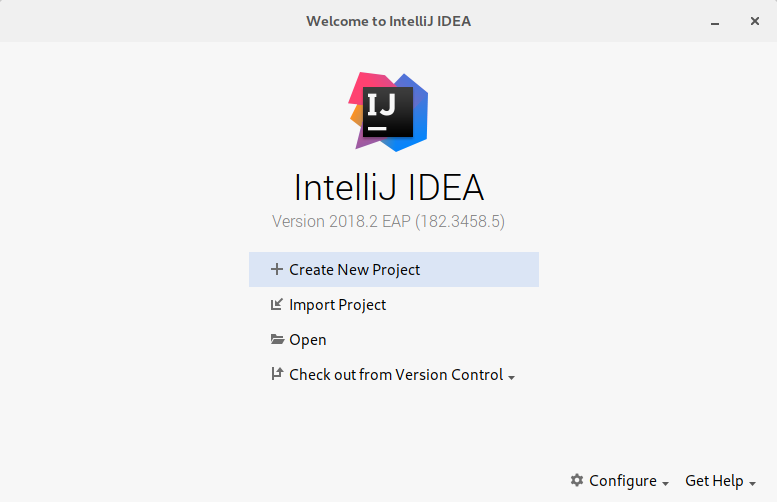
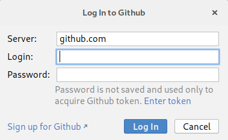
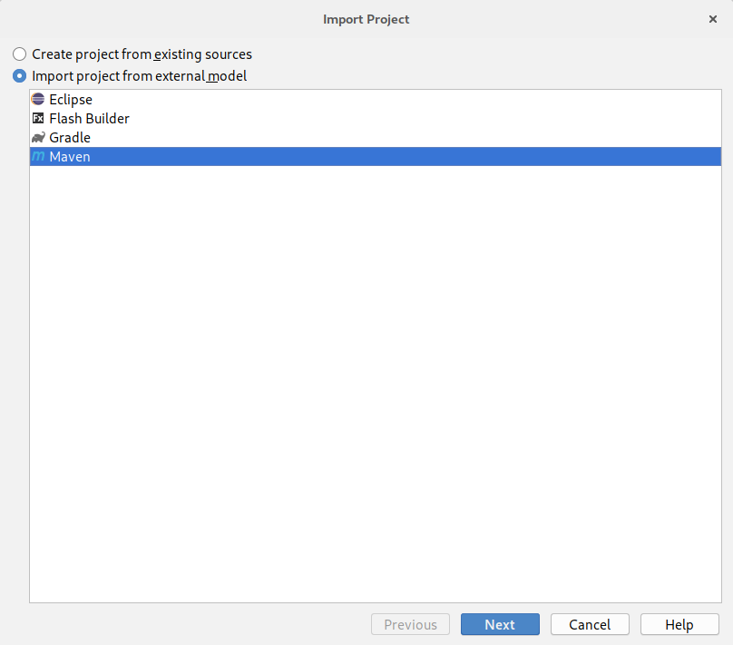
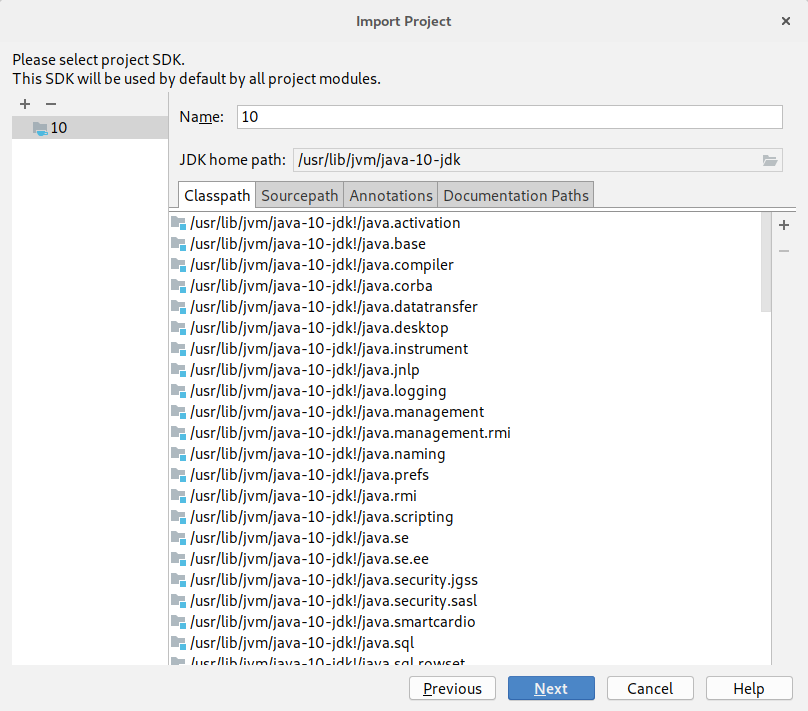
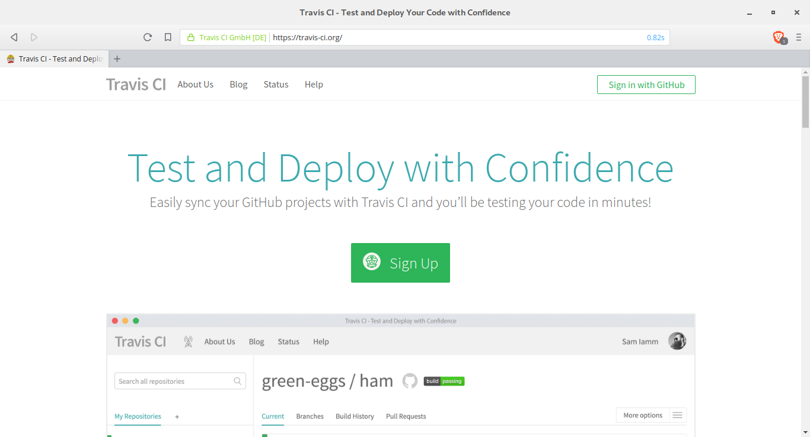
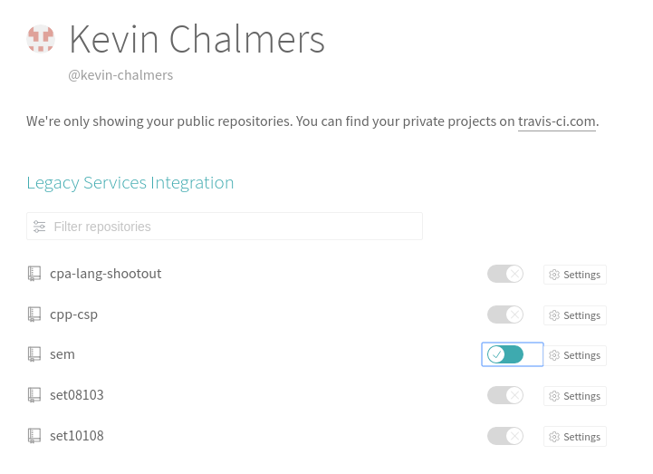
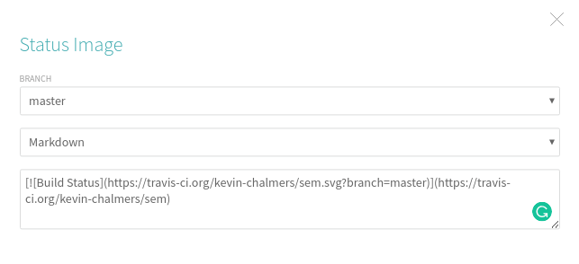

# Lab 02: Continous Integration Setup

In this lab we will automate our build process using [Travis CI](https://travis-ci.org/).  CI is [Continous Integration](https://en.wikipedia.org/wiki/Continuous_integration), a software engineering method where we ensure our local development software versions are merged into the mainline code several times a day.  There are several CI approaches available, but Travis is easy to plug into our software production pipeline.

## Behavioural Objectives

- [ ] To do

## Pulling Back Your Project

At the end of the last lab we had a working application that we could deploy to Docker.  Everything was done using three files:

- A **pom.xml** Maven build file, which we have not explored further yet.
- An **App.java** code file that contains our current code which is just a *Hello World* example.
- A **Dockerfile** that specifies how to run our application in a seperate Docker container.

We have three other files in our repository:

- A **.gitignore** file to tell Git which files and folders to ignore for versioning.
- A **README.md** file for our project.
- A **LICENSE** file defining the licensing terms for our project.

Everything is in our GitHub repository.  We can pull this back in IntelliJ to start from where we left off.  If your code is still on the machine you are using you can ignore this step.

### Starting IntelliJ

Start IntelliJ to get the landing window:



The button to click on is **Check out from Version Control**, then select **Git**:


The simplest method is to click on **Login with GitHub** and add your details to the following window:



Enter your login details.  The window will stay open, so click **Cancel**.  Don't worry - you will have logged in.

Open the **Check out from Version Control** window again, and select the **sem** repo we created in the last lab.  Click **Clone** and select **Yes** to have IntelliJ create a new project from the source code.  This will open the **Import Project** window:



Select **Import project from external model** and **Maven** and select **Next**.  This will open the following window:


Ensure that **Import Maven Projects Automatically** is selected and click **Next**.  The following window will open:


Click **Next**.  The following window will open:



Click **Next** again.  The following window will open:


Click **Finish** to complete the import process and open the main IntelliJ window.

Now we need to check that everything works correctly.  Perform the following steps:

1. Build the project (**Build** then **Build Project**).
2. Run the project locally (open **App.java** and click the **green triangle** next to **public class App** and select **Run App.main()**).
3. Install Docker and the IntelliJ Docker plugin if needed (see [the last lab](../lab01/)).
4. Run the project via Docker (open **Dockerfile** and click the **green triangles** at the top of the file and select **Run on Docker**).

Hopefully everything has worked and we are back to the point we left off at last week.  **Remember these steps**.  You will need to repeat them every time you pull back your project to a new local system.

## Adding Travis CI to Your Repository

With our project back on our local machine we can setup Travis CI.  This is automated via the [Travis CI website](https://travis-ci.org/).  Go there now:



Select **Login with GitHub**.  If you are already logged into GitHub (which you probably are) this should be done fairly easily.  Once you have signed up and activated your account you should be taken to your profile page which has the URL `https://travis-ci.org/profile/<github-username>`:



Activate Travis for the **sem** repository by activating the toggle next to the project as shown in the image.  And that is it - Travis is integrated into our GitHub account.

Travis CI is triggered by pushes to our repository and so we do not need to do anything specific within Travis itself.  However, we do need to tell Travis how to build our application.

### Adding a Travis Build File

Add a new file to the root of your project called `.travis.yml`.  The contents are below:

```yml
language: java
```

Add that is it.  Travis can take a lot of configuration which we will see as we go through the module.  However, for Maven projects Travis knows what to do, so our life is easy.

Now to push the updates to our GitHub repository.  Remember the three steps.

1. Add the updates to the commit.
2. Create a commit.  Use a sensible message.
3. Push the commit.

Now we can go to the Travis and see if our build was successful.  You can click on the **sem** project in Travis, or go to the project's dashboard `https://travis-ci.org/<github-username>/sem`.  You should see something similar to the following:


Which shows our build is passing.  You can also see the build log under this information to see where problems are.

### Adding Travis Badge

You might have seen build status badges on GitHub before like this one:

[](https://travis-ci.org/kevin-chalmers/sem)

This is taken straight from Travis CI and you can add the badge for your build status to your `README.md` file as well.  To do this, click on the build status badge for your project in Travis CI.  This will open a window allowing you to get the code to access the build status badge:



Make sure you select **Markdown**.  Now we just need to add this to our `README.md` file for the project.  Change the build status code to that which you get from Travis.

```md
# Software Engineering Methods

- Master Build Status [](https://travis-ci.org/kevin-chalmers/sem)
```

Now go through our Git update steps:

1. Add files to commit.
2. Create commit.
3. Push to GitHub.

Now if you go to your GitHub page you should see the following:


And now we have our project automatically building on pushes to GitHub, and the current build status being displayed on our GitHub landing page.

### Other Badges

You can add various badges to your project.  [Sheilds.io](https://shields.io/) is one such site that provides badges.  We are going to add two to our `README.md`: one for our license and one for our release.  The license badge takes the URL:

`[](https://github.com/<github-username>/sem/blob/master/LICENSE)`

Just replace `<github-username>` with your GitHub username.  The release badge is:

`[](https://github.com/<github-username>/sem/releases)`

At the moment we don't have any releases so the badge won't work.  We will recify this shortly.  Update your `README.md` file to the following (remembering to change the username):

```md
# Software Engineering Methods

- Master Build Status [](https://travis-ci.org/kevin-chalmers/sem)
- License [](https://github.com/kevin-chalmers/sem/blob/master/LICENSE)
- Release [](https://github.com/kevin-chalmers/sem/releases)
```

And then update your GitHub repository:

1. Add files to commit.
2. Create commit.
3. Push to GitHub.

If you go to your repository's dashboard in GitHub you should see your new badges.

## Travis and Docker

## Setting up GitFlow Workflow

### Develop Branch

#### Adding Develop Build Status to GitHub

### Feature Branch

## Versioning and Version Tags

## Updating our Example Application