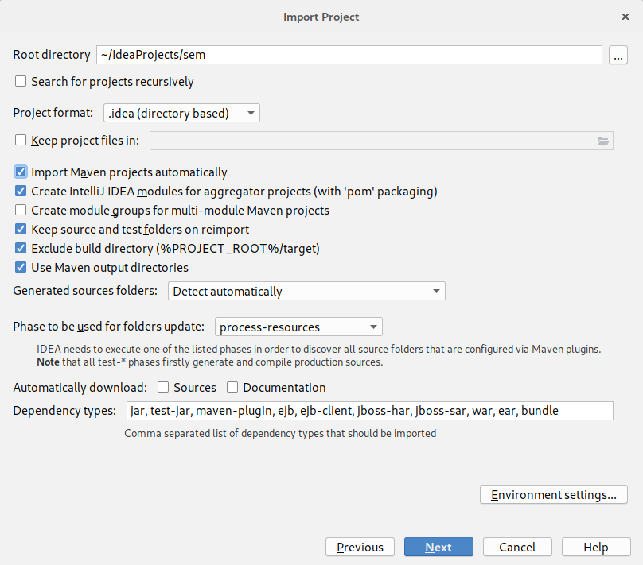
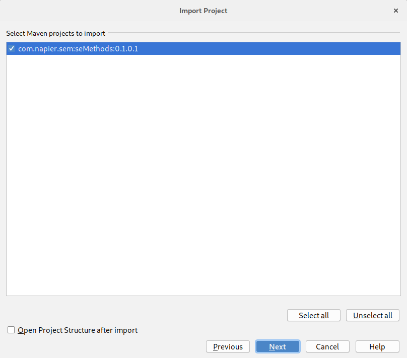
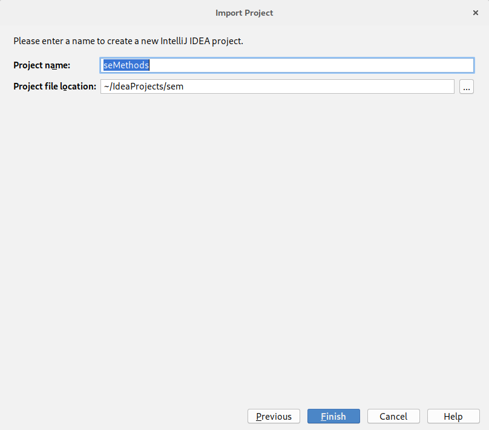

# Lab 02: Continous Integration Setup

In this lab we will automate our build process using [Travis CI](https://travis-ci.org/).  CI is [Continous Integration](https://en.wikipedia.org/wiki/Continuous_integration), a software engineering method where we ensure our local development software versions are merged into the mainline code several times a day.  There are several CI approaches available, but Travis is easy to plug into our software production pipeline.

## Behavioural Objectives

- [ ] To do

## Pulling Back Your Project

At the end of the last lab we had a working application that we could deploy to Docker.  Everything was done using three files:

- A **pom.xml** Maven build file, which we have not explored further yet.
- An **App.java** code file that contains our current code which is just a *Hello World* example.
- A **Dockerfile** that specifies how to run our application in a seperate Docker container.

We have three other files in our repository:

- A **.gitignore** file to tell Git which files and folders to ignore for versioning.
- A **README.md** file for our project.
- A **LICENSE** file defining the licensing terms for our project.

Everything is in our GitHub repository.  We can pull this back in IntelliJ to start from where we left off.  If your code is still on the machine you are using you can ignore this step.

### Starting IntelliJ

Start IntelliJ to get the landing window:

The button to click on is **Check out from Version Control**, then select **Git**:

The simplest method is to click on **Login with GitHub** and add your details to the following window:

Enter your login details.  The window will stay open, so click **Cancel**.  Don't worry - you will have logged in.

Open the **Check out from Version Control** window again, and select the **sem** repo we created in the last lab.  Click **Clone** and select **Yes** to have IntelliJ create a new project from the source code.  This will open the **Import Project** window:

Select **Import project from external model** and **Maven** and select **Next**.  This will open the following window:

Ensure that **Import Maven Projects Automatically** is selected and click **Next**.  The following window will open:

Click **Next**.  The following window will open:

Click **Next** again.  The following window will open:

Click **Finish** to complete the import process and open the main IntelliJ window.

Now we need to check that everything works correctly.  Perform the following steps:

1. Build the project (**Build** then **Build Project**).
2. Run the project locally (open **App.java** and click the **green triangle** next to **public class App** and select **Run App.main()**).
3. Install Docker and the IntelliJ Docker plugin if needed (see [the last lab](../lab01/)).
4. Run the project via Docker (open **Dockerfile** and click the **green triangles** at the top of the file and select **Run on Docker**).

Hopefully everything has worked and we are back to the point we left off at last week.

## Adding Travis CI to Your Repository

### Creating a Travis Account

### Adding Repository to Travis

### Adding a Travis Build File

### Adding Travis Badge

### Other Badges

## Travis and Docker

## Setting up GitFlow Workflow

### Develop Branch

#### Adding Develop Build Status to GitHub

### Feature Branch

## Updating our Example Application