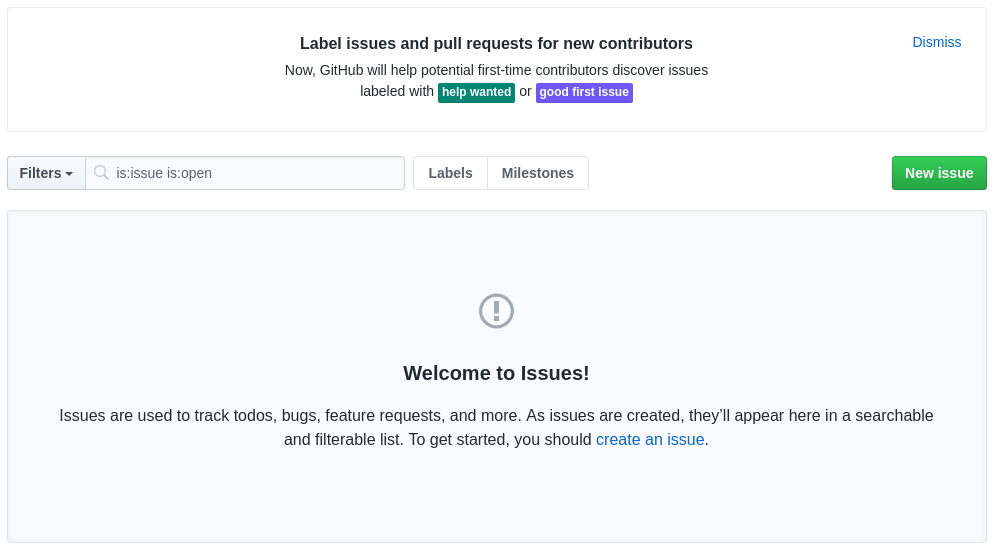
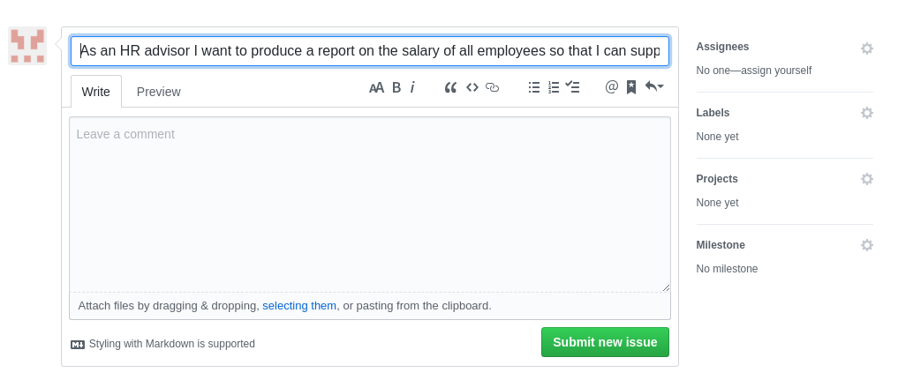
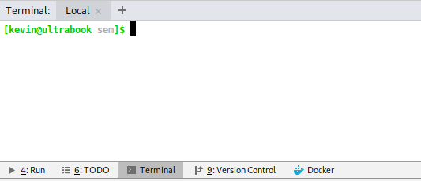

# Lab 03: Requirements and Issues

Steps:

18. Close feature.
19. Do release.

In this lab we will use GitHub issues to start tracking our work.  This is stage one of starting a Kanban system to monitor our work.  We will start by defining our **Vision** for the application, using this to define **features**, and from these **User Stories**.

## Behavioural Objectives

## Vision Statement

Here is a cut-down Vision Statement for the product we will develop in the labs:

### Introduction

#### Purpose

The purpose of the application is to manage employee records for a company.  The system will primarily used by the Human Resources Department (HR) and managers.  An existing SQL database exists with this data.

#### Solution Overview

The application will provide a front-end to the employee database with the ability to add, delete, and update records.  This will allow the HR team to be more efficient in processing employee data, and provide managers with information about current salary and role quickly for appraisal meetings.

### User Description

The users are mainly HR advisors who have limited technical knowledge and require reports to be produced and employee records updated.  The HR advisors work via web interfaces mainly, although a desktop application linked to a server is a possible work-around.

### Features

#### Produce a Salary Report

The application will produce a report on the current salary of all employees (HR), employees in a department (HR and department manager), and employees by job title (HR).  The current salary reports are used in financial reporting and planning.

#### Add a New Employee

The application will allow HR advisors to add a new employee when they start.  This is to ensure new employees are paid.

#### View an Employee Record

The application will allow an HR advisor of department manager to view the record for an employee in a department.  The view is used during any promotion request.

#### Update an Employee Record

The application will allow an HR advisor to update an employee record.  This is to ensure records are kept up-to-date.

#### Delete an Employee Record

The application will allow an HR advisor to delete an employee record.  This is to ensure the organisation does not retain date it no longer needs.

## Getting Started

You need to set-up your application as [last week](../lab02).  Check that everything works after you've pulled down your code.

## Defining User Stories

Our job is to define the initial requirements for the system to be developed.  We will do this by specifying **User Stories** (see [Lecture 10](../../lectures/lecture10) for more details).  A user story has the following form:

> As a *role* I want *feature* so that *value*.

From the vision statement, we can define the following initial user stories:

1. As an *HR advisor* I want *to produce a report on the salary of all employees* so that *I can support financial reporting of the organisation.*
2. As an *HR advisor* I want *to produce a report on the salary of employees in a department* so that *I can support financial reporting of the organisation.*
3. As an *department manager* I want *to produce a report on the salary of employees in my department* so that *I can support financial reporting for my department.*
4. As an *HR advisor* I want *to produce a report on the salary of employees of a given role* so that *I can support financial reporting of the organisation.*
5. As an *HR advisor* I want *to add a new employee's details* so that *I can ensure the new employee is paid.*
6. As an *HR advisor* I want *to view and employee's details* so that *the employee's promotion request can be supported.*
7. As an *HR advisor* I want *to update an employee's details* so that *employee's details are kept up-to-date.*
8. As an *HR advisor* I want *to delete an employee's details* so that *the company is compliant with data retention legislation.*

From an initial pass we have eight features to implement.  We will break down these tasks further as required.

### GitHub Issues

We are going to use GitHub issues to track our User Stories.  From the main GitHub page for your repository you will see **Issues** on the toolbar:


**Select the Issues tab**.  This will open the *Issues window*:



**Click the New Issue button**.  We can now add a new issue.  We will add the first User Story above:



**Click Submit New Issue**.  Your issue will be added to GitHub.

### Exercise

Add the other seven User Stories as GitHub issues.

## Working on a Feature

We will now work on a User Story.  The simplest one is:

6. As an *HR advisor* I want *to view and employee's details* so that *the employee's promotion request can be supported.*

First, **create a new branch from `develop` called `feature/view-record`**.  This will be our work branch to add this feature.

The User Story contains a number of tasks we need to extract:

1. Connect to the existing database.
2. Add function to extract employee record based on ID.
3. Display the employee record.

For Task 1 we have to have a database of employee data.  We will use the *MySQL Employee Sample Database* provided on [GitHub](https://github.com/datacharmer/test_db) (instructions [here](https://dev.mysql.com/doc/employee/en/)).  To use this, we will have to switch our database container to MySQL, upload the sample data, and integrate with our existing application.  To make this easier, we will use **Docker Compose**.

## Docker Compose

Docker Compose allows us to define a collection of containers that operate together.  We are going to have two containers: a **MySQL** container and an **Application** container.  First, we need to define our database in our application.

### Add Database Support

A Docker container [is available for MySQL](https://hub.docker.com/_/mysql/).  That is the easy part.  What we need to do is add an existing database to the container.  We can do this in a Dockerfile if we have the database on the local file system.  We can get the database from GitHub, and we can incorporate an external Git **submodule** easily.  Let us do that first.

#### Git Submodules

A **Git Submodule** is when we have other Git repositories linked to our main one.  This is useful when we want to include external libraries in our build pipeline.  Git submodules are not included in the tracking of the local repository, so do not add anything to your main repository.  To use submodules, we add a `.gitmodules` file to the root of the project folder.  The contents of this file are:

```
[submodule "db/test_db"]
path = db/test_db
url = https://github.com/datacharmer/test_db
```

This will add the files from example SQL database to the folder `db/test_db` once we initialise the Git submodule.  Unfortunately, IntelliJ is not very good at managing submodules, so we will have to do this in the terminal.  IntelliJ does provide a terminal - there is a tab at the bottom:



From the terminal we need to execute the following two commands:

```shell
git submodule init
git submodule update
```

Git will pull the repository.  You should now have the `db/test_db` folder.

#### Dockerfile for Database

Next we need a Dockerfile to run a MySQL database instance with the given files.  The following `Dockerfile` should be stored in the `db` folder:

```dockerfile
# Use the latest MySQL image
FROM mysql
# Set the working directory
WORKDIR /tmp
# Copy all the files to the working directory of the container
COPY test_db/*.sql /tmp/
COPY test_db/*.dump /tmp/
# Copy the main SQL file to docker-entrypoint-initdb.d.
# Scripts and SQL files in this folder are executed on container startup.
# This is specific to MySQL.
COPY test_db/employees.sql /docker-entrypoint-initdb.d
# Set the root password
ENV MYSQL_ROOT_PASSWORD example
```

The comments explain what the Dockerfile does.

#### Test Database

We are now in a position to test that our database works.  To do this, just click the green play button in the database Dockerfile and select `Run on Docker`.  Look at the **Log** (give it some time to get finished), and you should see:

```shell
...
mysql: [Warning] Using a password on the command line interface can be insecure.
INFO
CREATING DATABASE STRUCTURE
INFO
storage engine: InnoDB
INFO
LOADING departments
INFO
LOADING employees
INFO
LOADING dept_emp
INFO
LOADING dept_manager
INFO
LOADING titles
INFO
LOADING salaries
```

Now you should commit this change and push it to the remote.  We have completed part of the new feature add.

### Add Docker Compose File

Now we can create a **Docker Compose** file.  This is a configuration file that has more than one service defined.  We want to have our application and our database services up and running.  Therefore, our initial file (saved in `docker-compose.yml` in the root) is as follows:

```yml
version: '3'
services:
  # Application Dockerfile is in same folder which is .
  app:
    build: .

  # db is is db folder
  db:
    build: db/.
    command: --default-authentication-plugin=mysql_native_password
    restart: always
```

### Test MySQL Connection

Now we need to update our main application to move from MongoDB to MySQL.  A MySQL server takes a bit more time to start-up, so we need to have code to attempt to connect multiple times.  The Java code below is our new application.

```java
package com.napier.sem;

import java.sql.*;

public class App
{
    public static void main(String[] args)
    {
        try
        {
            // Load Database driver
            Class.forName("com.mysql.jdbc.Driver");
        }
        catch (ClassNotFoundException e)
        {
            System.out.println("Could not load SQL driver");
            System.exit(-1);
        }

        // Connection to the database
        Connection con = null;
        int retries = 100;
        for (int i = 0; i < retries; ++i)
        {
            System.out.println("Connecting to database...");
            try
            {
                // Wait a bit for db to start
                Thread.sleep(10000);
                // Connect to database
                con = DriverManager.getConnection("jdbc:mysql://db:3306?verifyServerCertificate=false&useSSL=true", "root", "example");
                System.out.println("Successfully connected");
                // Wait a bit
                Thread.sleep(10000);
                // Exit for loop
                break;
            }
            catch (SQLException sqle)
            {
                System.out.println("Failed to connect to database attempt " + Integer.toString(i));
                System.out.println(sqle.getMessage());
            }
            catch (InterruptedException ie)
            {
                System.out.println("Thread interrupted? Should not happen.");
            }
        }

        if (con != null)
        {
            try
            {
                // Close connection
                con.close();
            }
            catch (Exception e)
            {
                System.out.println("Error closing connection to database");
            }
        }
    }
}
```

Now we can test the application and MySQL database together by undertaking the following steps:

1. Compile the application.
2. Package the application.
3. Deploy the composed Docker services - we do this by running the `docker-compose.yml` file as any other Dockerfile.
4. Wait for the application to start-up.


### Update Travis File

```yml
sudo: required

language: java

services:
  - docker

after_success:
  - docker-compose up
```

### Push Changes

### Check CI Build

## Extract Employee Information

## Display Employee Information