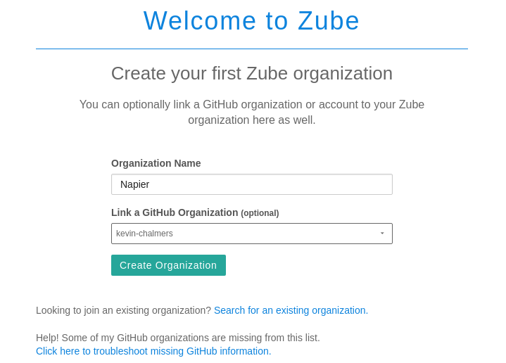
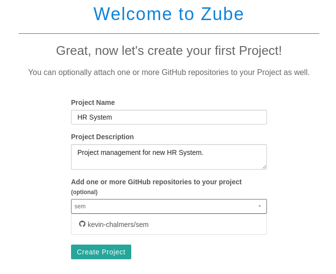
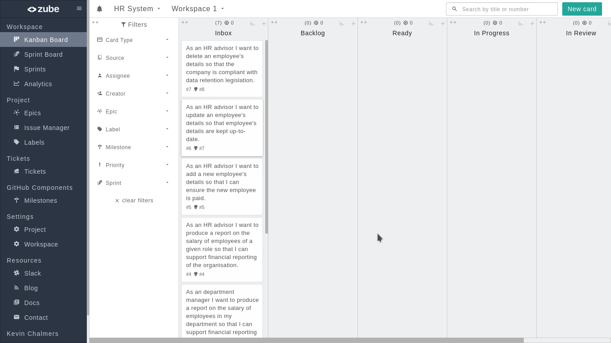
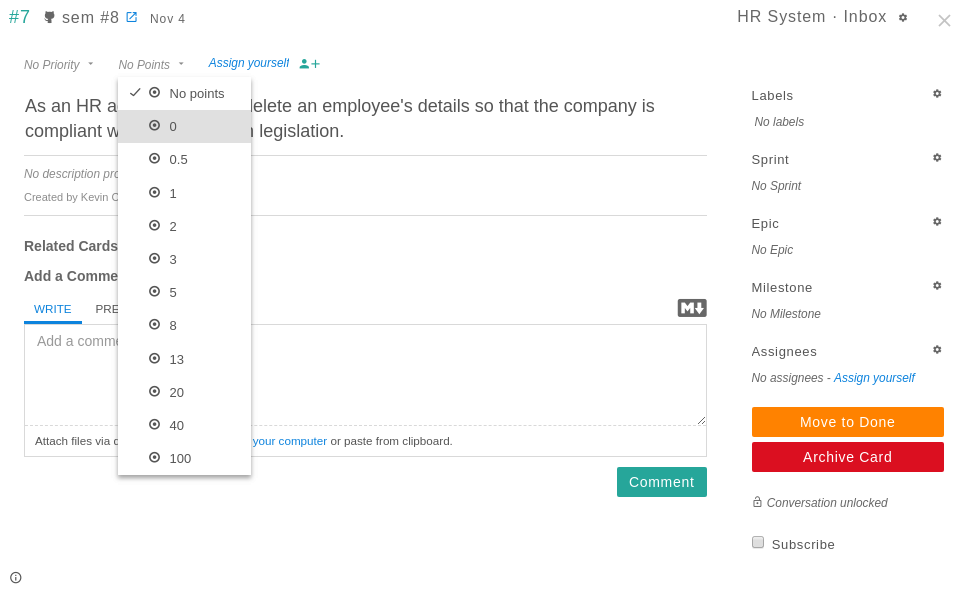

# Lab 04: Task Management and Kanban

Our next step is to extend our task management system beyond simple GitHub issues.  We will use a task board approach that comes from [Kanban](https://en.wikipedia.org/wiki/Kanban_(development)).  [Lecture 8](../../lectures/lecture08) goes into more detail about Kanban.

## Behavioural Objectives

- [ ] TODO

## Setting up Zube.io

GitHub does support task boards - see the **Projects** tab in your repository for details.  We are going to use a different system provided by [Zube](https://zube.io/).  This is because Zube:

- Integrates with GitHub tasks.
- Provides more functionality, such as story points.

Connecting your GitHub repository is simple.  Just go to https://zube.io/ and click the **Signup with GitHub** button.

Follow the instructions to connect your account.  Once you get to the main screen you are ready to start setting up your project.

### Creating an Organisation

Next we need to create a new organisation in Zube.  An organisation is a way of managing projects.  You should see a button with **Create a new organization**.  Click this button to open the new organisation window.

Use **Napier** as the organisation name, and **ensure you link to your account name as an organisation** and click **Create Organization**.  This will open the new project window.

### Creating a Project

Next we need to create a project:

**Ensure you link the repository you are using for the labs.**  Use the same details as above and click **Create Project**.

## Organising Your Task Board

You should now see your project task board:

We are now going to go through two processes:

1. Assigning story points to our current tasks.
2. Prioritising tasks.

### Assigning Story Points

In the notes for [Lecture 2](../../lectures/lecture02) we looked at how we assign points to tasks.  It is all about estimating the size of a task against other tasks.  Zube lets us assign story points to tasks.  To do so, **Click** on a **task card** on the Kanban board.  This will open the task details window:

As you can see, there is a drop-down menu where you can set the points for a task.  To close the details of a task **click** the **cross** at the top-right of the details window.

#### Exercise

Assign points to our current tasks.  It is up-to-you to decide the scores based on your own estimate.

### Prioritising Tasks

Next we will prioritise tasks.  This is done by moving task cards up and down in the task board.  It is that simple.  Ordering tasks is the job of the **Product Owner**.  At present, the order of tasks needs to be:

- #1 Produce a report of all salaries.
- #4 Produce a report of salaries by role.
- #2 Produce a report of salaries by department (HR advisor).
- #3 Produce a report of salaries by department (department manager).
- #5 Add new employee.
- #7 Update employee details.
- #8 Delete employee details.

This is the current order tasks will be completed for the project, but it is subject to change.  Remember, we have planned, but we will keep planning.

## Setting up a Sprint Board

Now it is time to set up a *Sprint*.  

## Next Feature: Salary Report

## Starting a Sprint

## Adding New Tasks

## Getting Salary Information

## Printing Salary Information

## Committing and Cleaning Up

