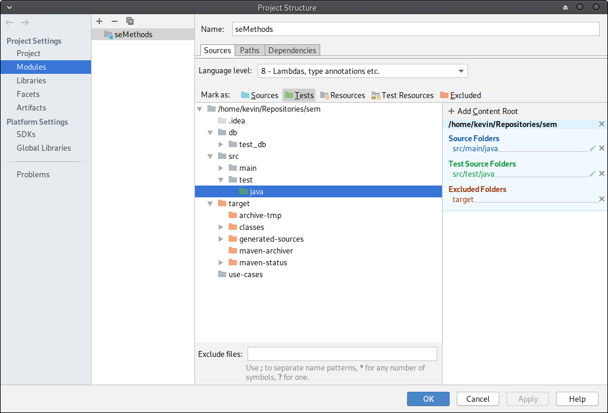
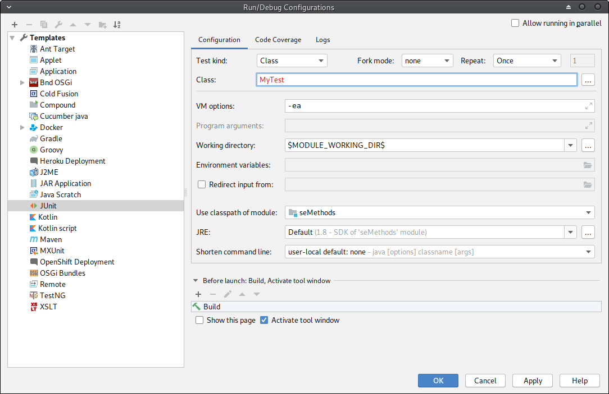
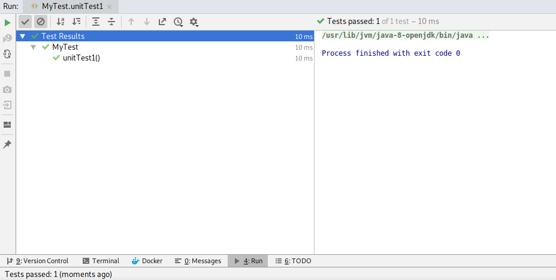
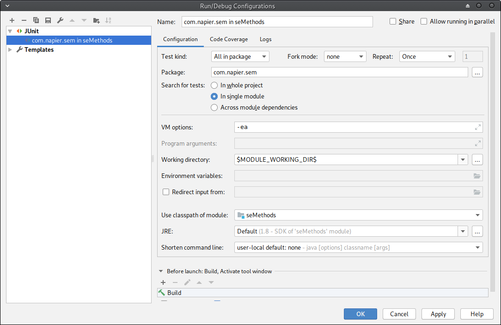
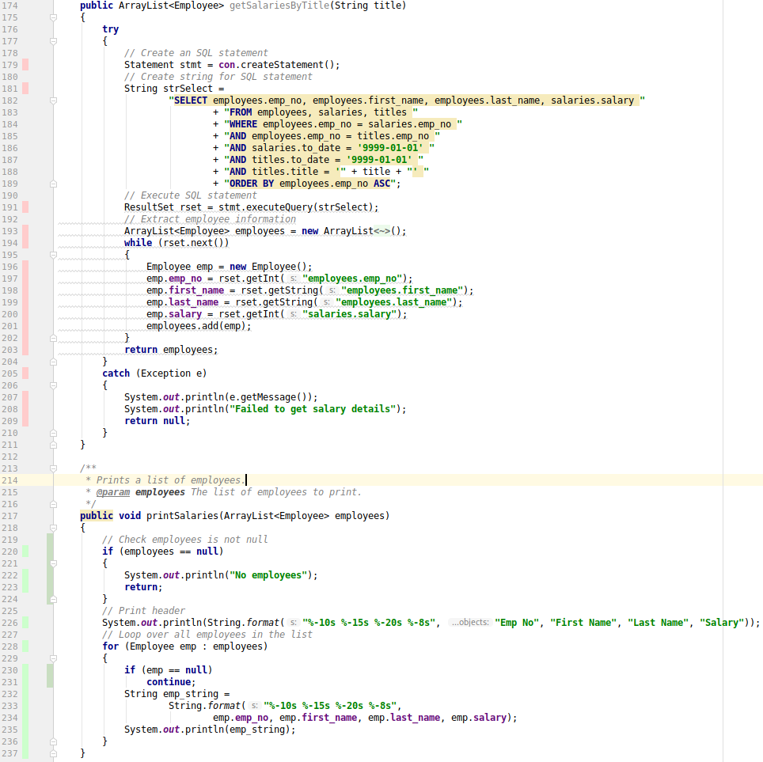

# Lab 07: Unit Testing

In this lab we will add automated testing to our method.  Unit Testing is a technique for testing individual *units* of code.  A unit is a piece of functionality - normally an individual pathway through a method.  We can write code that will test this branch of the application, and thus automate our testing process.  This will give us confidence in our code as we continue to develop it.

## Behavioural Objectives

- [ ] TODO

## What is Unit Testing?

[Wikipedia](https://en.wikipedia.org/wiki/Unit_testing) defines unit testing as (emphasis mine):

> In computer programming, unit testing is a **software testing method** by which **individual units of source code, sets of one or more computer program modules** together with associated control data, usage procedures, and operating procedures, **are tested to determine whether they are fit for use**.

Also from Wikipedia:

> Intuitively, one can view a unit as **the smallest testable part of an application**.

From these statements, we can define unit testing as:

- a *software testing method*.
- testing the *smallest part of an application*.
- to determine *fitness for use*.

Let us look at an example:

```java
public int method(String str)
{
    if (str != null)
        return str.length();
    else
        return -1;
}
```

Here we have two pathways through our code: the two branches of the `if` statement.  A unit test would test one of these branches to see if it works correctly.  That means we need at least two unit tests:

1. When `str` is not `null`.
2. When `str` is `null`.

An example unit test here could be:

```java
@Test
public void testMethod1()
{
    assertEqual(5, method("Hello"));
}
```

The unit test is checking if `method` will return `5` when `Hello` is provided as an input.  The `assertEquals` means that if `method` does not return `5` then the test will fail.

Unit testing is now a **fundamental** part of software development and you should start using it as common practice from now on.  There are unit testing frameworks for most languages.  We will cover how to get started with Maven an IntelliJ in this lab.  There is plenty of material online on other approaches in other languages.

## Getting Started with Unit Testing in Maven and IntelliJ

Maven and IntelliJ both support unit testing as part of their workflows.  This means we can add the configuration for unit testing to our Maven file and IntelliJ will automatically understand what is happening.  It also allows us to run our unit tests via Travis CI later.

### Maven Configuration Code for JUnit

```xml
<dependency>
    <groupId>org.junit.jupiter</groupId>
    <artifactId>junit-jupiter-api</artifactId>
    <version>5.1.0</version>
    <scope>test</scope>
</dependency>
```

```xml
<dependencies>
    <dependency>
        <groupId>mysql</groupId>
        <artifactId>mysql-connector-java</artifactId>
        <version>5.1.44</version>
    </dependency>

    <dependency>
        <groupId>org.junit.jupiter</groupId>
        <artifactId>junit-jupiter-api</artifactId>
        <version>5.1.0</version>
        <scope>test</scope>
    </dependency>
</dependencies>
```

```xml
<plugin>
    <groupId>org.apache.maven.plugins</groupId>
    <artifactId>maven-surefire-plugin</artifactId>
    <version>2.19.1</version>
    <dependencies>
        <dependency>
            <groupId>org.junit.platform</groupId>
            <artifactId>junit-platform-surefire-provider</artifactId>
            <version>1.1.0</version>
        </dependency>
        <dependency>
            <groupId>org.junit.jupiter</groupId>
            <artifactId>junit-jupiter-engine</artifactId>
            <version>5.1.0</version>
        </dependency>
    </dependencies>
</plugin>
```

### Our First Unit Test

Add test folder to src.

Add test class.

```java
import org.junit.jupiter.api.*;
import static org.junit.jupiter.api.Assertions.*;


class MyTest
{
    @Test
    void unitTest()
    {
        assertEquals(5, 5);
    }
}
```

### Running the Tests via Maven

```shell
-------------------------------------------------------
 T E S T S
-------------------------------------------------------
Running MyTest
Tests run: 1, Failures: 0, Errors: 0, Skipped: 0, Time elapsed: 0.008 sec - in MyTest

Results :

Tests run: 1, Failures: 0, Errors: 0, Skipped: 0
```

### Adding a JUnit Configuration to IntelliJ Build

Set test folder.  File, Project Structure.



Add configuration.



### Running Tests



```java
@Test
void unitTest2()
{
    assertEquals(5, 4);
}
```


Notice also the failing test is red underlined in the code.

### Other Test Examples

```java
@Test
void unitTest3()
{
    assertEquals(5, 5, "Messages are equal");
}

@Test
void unitTest4()
{
    assertEquals(5.0, 5.01, 0.02);
}

@Test
void unitTest5()
{
    int[] a = {1, 2, 3};
    int[] b = {1, 2, 3};
    assertArrayEquals(a, b);
}

@Test
void unitTest6()
{
    assertTrue(5 == 5);
}

@Test
void unitTest7()
{
    assertFalse(5 == 4);
}

@Test
void unitTest8()
{
    assertNull(null);
}

@Test
void unitTest9()
{
    assertNotNull("Hello");
}

@Test
void unitTest10()
{
    assertThrows(NullPointerException.class, this::throwsException);
}

void throwsException() throws NullPointerException
{
    throw new NullPointerException();
}
```

## Adding Tests to the HR System: Printing Salaries

### Inputs to Printing Salaries

null

empty list

list with null member

list with all non-null members

### Unit Tests for Printing Salaries

Delete existing test file.

Update configuration.



#### Employees is `null`

```java
package com.napier.sem;

import org.junit.jupiter.api.BeforeAll;
import org.junit.jupiter.api.Test;
import org.junit.jupiter.api.TestInstance;

import java.util.ArrayList;

import static org.junit.jupiter.api.Assertions.*;

public class AppTest
{
    static App app;

    @BeforeAll
    static void init()
    {
        app = new App();
    }

    @Test
    void printSalariesTestNull()
    {
        app.printSalaries(null);
    }
}
```

```java
public void printSalaries(ArrayList<Employee> employees)
{
    // Check employees is not null
    if (employees == null)
    {
        System.out.println("No employees");
        return;
    }
    // Print header
    System.out.println(String.format("%-10s %-15s %-20s %-8s", "Emp No", "First Name", "Last Name", "Salary"));
    // Loop over all employees in the list
    for (Employee emp : employees)
    {
        String emp_string =
                String.format("%-10s %-15s %-20s %-8s",
                        emp.emp_no, emp.first_name, emp.last_name, emp.salary);
        System.out.println(emp_string);
    }
}
```

```java
@Test 
void printSalariesTestEmpty()
{
    ArrayList<Employee> employess = new ArrayList<Employee>();
    app.printSalaries(employess);
}
```

```java
public void printSalaries(ArrayList<Employee> employees)
{
    // Check employees is not null
    if (employees == null)
    {
        System.out.println("No employees");
        return;
    }
    // Print header
    System.out.println(String.format("%-10s %-15s %-20s %-8s", "Emp No", "First Name", "Last Name", "Salary"));
    // Loop over all employees in the list
    for (Employee emp : employees)
    {
        if (emp == null)
            continue;
        String emp_string =
                String.format("%-10s %-15s %-20s %-8s",
                        emp.emp_no, emp.first_name, emp.last_name, emp.salary);
        System.out.println(emp_string);
    }
}
```

```java
@Test
void printSalaries()
{
    ArrayList<Employee> employees = new ArrayList<Employee>();
    Employee emp = new Employee();
    emp.emp_no = 1;
    emp.first_name = "Kevin";
    emp.last_name = "Chalmers";
    emp.title = "Engineer";
    emp.salary = 55000;
    employees.add(emp);
    app.printSalaries(employees);
}
```

## Code Coverage


Run, run with coverage.




## Next Feature: Department Manager Printing Salaries

## Exercise: Add Unit Tests for Display Employee

## Cleanup