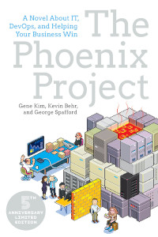

# Lecture 06: The Three Ways - Underpinning Principles of DevOps

Concepts of WIP and time to deliver.

GitFlow workflow

## Behavioural Objectives

## Overview of DevOps

|       | **1970s-1980s** | **1990s** | **2000s-Present** |
|-------|-----------------|-----------|-------------------|
| **Era** | Mainframes | Client/server | Cloud |
| **Technology** | COBOL, DB2 | C++, Oracle | Java, MySQL, etc. |
| **Cycle time** | 1-5 years | 3-12 months | 2-12 weeks |
| **Cost** | $1M-$100M | $100k-$10M | $10k-$1M |
| **At risk** | The whole company | Product line or division | Product feature |
| **Cost of failure** | Bankruptcy | Revenue miss | Negligible |

<iframe width="560" height="315" src="https://www.youtube.com/embed/wyWI3gLpB8o" frameborder="0" allow="accelerometer; autoplay; encrypted-media; gyroscope; picture-in-picture" allowfullscreen></iframe>

## The First Way of DevOps: The Principles of Flow

### Make Work Visible

### Limit Work in Progress (WiP)

### Reduce Batch Sizes

### Reduce the Number of Handoffs

### Continually Identify and Elevate Our Constraints

### Eliminate Waste in the Value Stream

## The Second Way of DevOps: The Principles of Feedback

### Working Safely with Complex Systems

### See Problems as They Occur

### Swarm and Solve Problems to Build New Knowledge

### Keep Pushing Quality Closer to the Source

### Enable Optimising for Downstream Work Centres

## The Third Way of DevOps: The Principles of Continual Learning and Experimentation

### Enabling Organisational Learning and a Safety Culture

### Institutionalise the Improvement of Daily Work

### Transform Local Discoveries into Global Improvements

### Inject Resilience Patterns into Our Daily Work

### Leaders Reinforce a Learning Culture

## Mapping the Module

So far we have covered the following topics in the module:

- Lecture 1: Introduction.
- Lecture 2: Scrum.
- Lecture 3: Version Control.
- Lecture 4: Lean Software Development.
- Lecture 5: Modern Software Architecture.
- Lecture 6: Introduction to DevOps.

The rest of the module is influenced by the three ways:

- The First Way: Flow.
  - Lecture 7: The First Way of DevOps: Flow.
  - Lecture 8: Kanban.
  - Lecture 9: Requirements Gathering.
  - Lecture 10: Use Cases and User Stories.
  - Lecture 11: UML Diagrams.
  - Lecture 12: UML Workflow.
- The Second Way: Feedback.
  - Lecture 13: The Second Way of DevOps: Feedback.
  - Lecture 14: Unit Testing and Test Driven Development.
  - Lecture 15: Continuous Integration.
  - Lecture 16: Continuous Delivery.
  - Lecture 17: Deploying Software.
  - Lecture 18: Monitoring Software.
  - Lecture 19: Bug Tracking.
- The Third Way: Continual Learning and Experimentation.
  - Lecture 20: The Third Way of DevOps: Continual Learning and Experimentation.

We then finish the module with more professional concerns:

- Lecture 21: Ethics and Professionalism.
- Lecture 22: Legal Issues.
- Lecture 23: Security Concerns.

The mapping is loose and based on our need to cover methods and develop our application.  However, being aware of the three principles is important as we go through the rest of the module:

- Flow.
- Feedback.
- Continual Learning and Experimentation.

## Summary

## Further Reading

The goto book on DevOps if *The DevOps Handbook: How to Create World-class Agility, Reliability & Security in Technology Organisations* by Gene Kim, Jez Humble, Patrick Debois, and John Willis.

If you like reading novels and would like a story introduction to DevOps and the culture, then *The Pheonix Project* by Gene Kim, Kevin Bahr, and George Spafford might be a good starting place.

